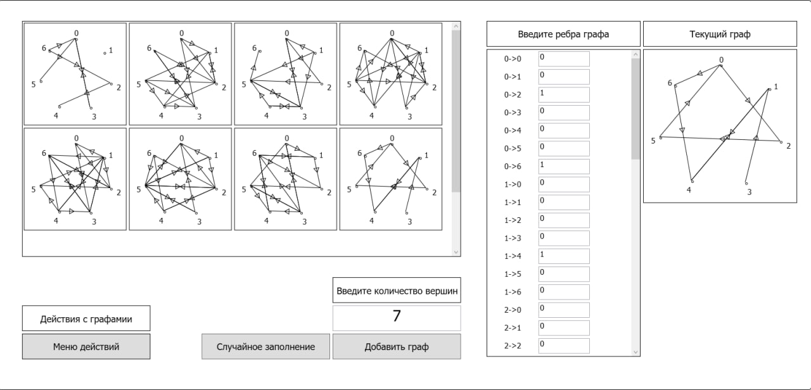

# Приложение для визуализации графов

WPF-приложение на C# для работы с графами, разработанное в Microsoft Visual Studio.

## Примеры интерфейса

### Главное окно

### Операции с графами

## Основные возможности

### Управление графами
- **Добавление/удаление** графов в рабочей области
- **Одинарный клик** - выделение графа
- **Двойной клик** - установка текущего графа

### Операции с графами
- **Математические операции**:
  - Сложение графов (объединение вершин и рёбер)
  - Вычитание графов (удаление совпадающих рёбер + добавление обратных)
  - Построение дерева кратчайших путей (выделяется красным)

- **Работа с данными**:
  - Сохранение/загрузка в XML-формате
  - Автосохранение состояния в БД при закрытии
  - Восстановление состояния при запуске

### Генерация графов
- Создание случайных графов:
  - Настраиваемое количество вершин
  - Вероятность появления ребра 65% (можно изменить в интерфейсе)

## Технические характеристики

### Архитектура
- **DLL-сборка** с основными классами для работы с графами
- **Двухуровневая структура**:
  - Базовый класс `Graph`
  - Производный класс `EditableGraph` (с функциями редактирования)

### Данные
- Типизированные коллекции вершин и рёбер
- Хранение данных в свойствах
- Индексаторы для доступа к элементам
- Использование LINQ для операций с данными

### Обработка ошибок
- Полная система проверок
- Ограничение на 10 вершин в графе

### Интерфейс
- Интерактивное управление графами
- Контекстные меню и подсказки
- Настройка весов рёбер (0 = отсутствие ребра)

## Реализация

### Хранение данных
- **XML-сериализация** графов
- **Интеграция с БД** для сохранения состояния
- Стандартные диалоги открытия/сохранения

## Использование

1. Создавайте графы через панель инструментов
2. Выделяйте графы одинарным кликом
3. Выполняйте операции через контекстное меню
4. Сохраняйте/загружайте через меню "Файл"
5. Состояние сохраняется автоматически

> **Важно**: Приложение ограничивает максимальное количество вершин (10).
